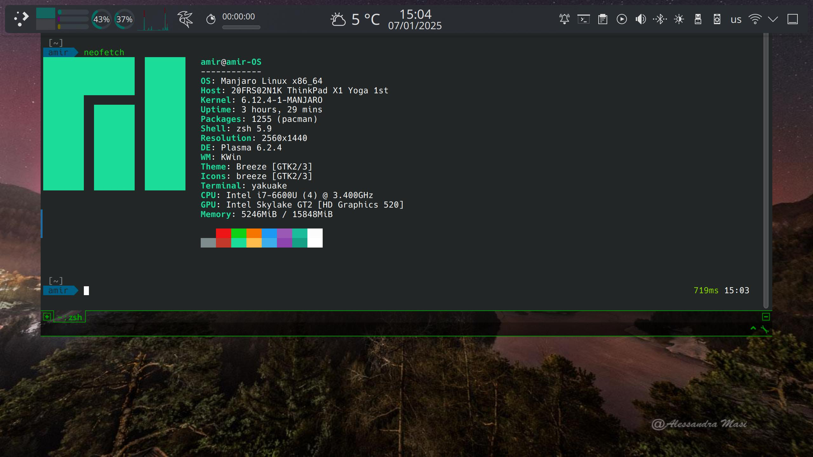

<p align="center">
  <a href="./assets/Screenshots/MyTerminal_shot1.jpg">
    
  </a>
</p>

# MyTerminal

> A customized terminal profile for [Manjaro KDE](https://manjaro.org/) (Arch-based distribution), inspired by [Pixegami Terminal Profile](https://github.com/pixegami/terminal-profile). For original setup instructions on Ubuntu and macOS, refer to the [Pixegami repository](https://github.com/pixegami/terminal-profile).

---

## Features

- **Enhanced Shell Experience**

  - Autocomplete and syntax highlighting
  - zsh-autosuggestions and zsh-completions
  - History substring search
  - Sudo support (double ESC to run last command as SU)

- **Version Control Integration**

  - Git and Mercurial (Hg) support

- **Development Environment**

  - virtualenv, conda, pyenv, and Python environment support

- **User Interface**

  - Modern and lightweight design
  - Optimized UX for quick execution
  - Prompt status display (command duration, etc.)

- **Compatibility**
  - Fully compatible with [Yakuake](https://github.com/KDE/yakuake)
  - Integration with KDE applets and packages

---

## Installation

### Automatic Installation

To set up MyTerminal automatically, follow these steps:

1. Clone the repository and navigate to it:

   ```bash
   git clone https://github.com/amm1rr/MyTerminal-for-Manjaro-KDE.git && cd MyTerminal
   ```

2. Run the installation script:
   ```bash
   ./install.sh
   ```

Done! Your terminal is now configured with the desired plugins and settings.

---

### Manual Installation

#### Prerequisites

Ensure your system has the following dependencies installed:

For Arch-based systems:

```bash
sudo pacman -Syu  # Update system
sudo pacman -S git vim zsh curl thefuck
```

#### Install Powerline Fonts

Powerline fonts provide special characters for themes like Git branches. Install the recommended font (RobotoMono for Powerline):

```bash
./install_powerline.sh
```

#### Set Up Zsh and Plugins

Switch to Zsh and enhance it with Oh My Zsh and plugins:

```bash
./install_terminal.sh
```

#### Configure Terminal Profile

Set up plugins, theme, font, and colors:

```bash
./install_profile.sh
```

This includes plugins like syntax highlighting, autosuggestions, and history substring search.

> You can explore other [Powerline Patched Fonts](https://github.com/powerline/fonts) if desired.

---

## Additional Tips

- **Display System Info:** Install [Neofetch](https://github.com/dylanaraps/neofetch) to showcase system details:
  ```bash
  sudo pacman -S neofetch
  neofetch --ascii_colors 6 8
  ```
- **Reset to Default Shell:** To revert back to Bash, uninstall Zsh or reset your default shell to Bash.

---

## Resources

- [Oh My Zsh!](https://medium.com/wearetheledger/oh-my-zsh-made-for-cli-lovers-installation-guide-3131ca5491fb)
- [Install Powerline](https://askubuntu.com/questions/283908/how-can-i-install-and-use-powerline-plugin)
- [Agnoster Theme](https://gist.github.com/3712874)
- [Pixegami Terminal Profile](https://github.com/pixegami/terminal-profile)
- [Yakuake](https://github.com/KDE/yakuake)
- [Vazir Code Font - Saber Rastikerdar](http://rastikerdar.blog.ir/)

[](https://github.com/Amm1rr)
