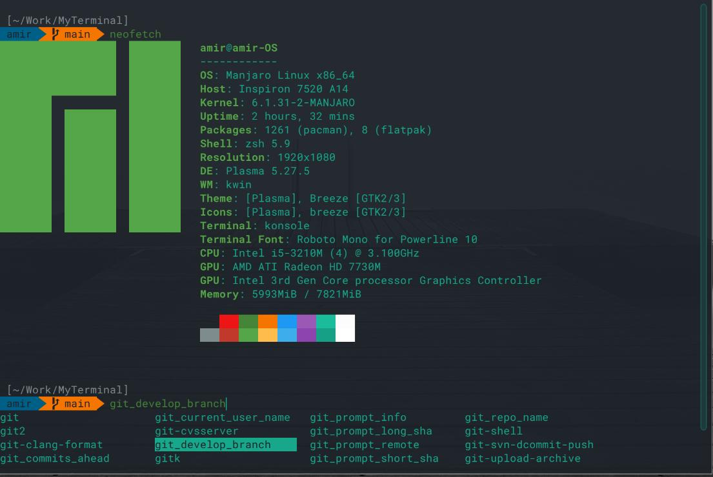

[](./myterminal_screenshot.png)

> It's a pork of [Pixegami Terminal Profile](https://github.com/pixegami/terminal-profile) made runnable on Manjaro KDE (an Arch-based distribution).
For original information on how to run it on Ubuntu and MacOS, please refer to the original repository [pixegami](https://github.com/pixegami/terminal-profile).


## MyTerminal

This is my terminal profile for running on Arch (Manjaro KDE), using the default terminal app [Konsole](https://github.com/KDE/konsole).


### Features:
- Autocomplete
- Syntax highlighting
- Fresh UI
- Smart UX
- Being lightweight is a primary goal
- The best configuration for working with [Yakuake](https://github.com/KDE/yakuake)
- Execute Time


## Automatic Installation

To automatically install MyTerminal, follow these steps:

1. Clone the repository by running the following command in your terminal:

    ```bash
    git clone https://github.com/Amm1rr/MyTerminal.git && cd MyTerminal
    ```

2. Once inside the cloned repository, run the installation script with the following command:

    ```bash
    ./install.sh
    ```

This script will automatically configure your terminal with the desired plugins and settings.


## Manual Installation

### Prerequisites

For the scripts to work, I think these are the bare minimum requirements.


#### Arch:
```bash
# Update your software repositories with pacman.
sudo pacman -Syu

# Install Git.
sudo pacman -S git

# Install Vim.
sudo pacman -S vim
```

### Powerline (and fonts)

First, we'll install the font (RobotoMono for Powerline). I'll also install it into VIM, since that
is my built-in editor of choice (but you don't have to use it).

The Powerline fonts also include special characters (like Git branches) that we will use later in
the terminal profile theme.

```bash
./install_powerline.sh
```

### ZSH, OhMyZSH and Plugins

The shell that I use is "ZSH", with the OhMyZSH upgrade on top of that. To install all of that stuff,
you can run the helper script (and may need to restart after).

```bash
./install_terminal.sh
```

After this, the terminal should look a bit different, but we need to do the next step to have the
entire theme.

### Profile (plugins, theme, font and color)

This script will first install two plugins that I like to use: auto-complete and color highlighting.

```bash
# You don't need to execute this - it's part of the script already.
(cd ~/.oh-my-zsh/custom/plugins && git clone https://github.com/zsh-users/zsh-syntax-highlighting)
(cd ~/.oh-my-zsh/custom/plugins && git clone https://github.com/zsh-users/zsh-autosuggestions)
```

It will also copy over the `.zshrc` and `myterminal-agnoster.zsh-theme` files for the
terminal to use (which will wire up the plugins and the theme).

The last command is to create a terminal profile that will set the colors and also set the font
to be the Powerline one we installed earlier (required for the theme to display correctly).

```bash
./install_profile.sh
```

> You can also change the font to any of the other [Powerline Patched Fonts](https://github.com/powerline/fonts) too if you don't like RobotoMono.

If it looks funky after this command, then you might need to wait until the theme is updated with a
Powerline font (the next step), and may need to also restart your machine.


## Notes

It is easy to make it runnable on Linux, macOS, or Windows Subsystem.

How to display terminal information like as screenshot (I use [Neofetch](https://github.com/dylanaraps/neofetch)).

```bash
sudo pacman -S neofetch

# Display the profile
# I override the colors in this theme
neofetch --ascii_colors 6 8
```


## How do I reset the changes back to the old terminal?

There's two main modifications being done to the terminal. The terminal theme, and the shell itself.

For the terminal shell itself, we actually installed a new terminal (zsh) alongside the default bash. Bash itself wasn't removed, but we just set the default shell to `zsh`. You can search for how to uninstall zsh and default back to bash.


## Sources

Here are some of the main resources I used as part of this terminal setup.

[Oh My Zsh!](https://medium.com/wearetheledger/oh-my-zsh-made-for-cli-lovers-installation-guide-3131ca5491fb) | [Install Powerline](https://askubuntu.com/questions/283908/how-can-i-install-and-use-powerline-plugin) | [Agnoster Theme](https://gist.github.com/3712874) | [Pixegami Terminal Profile](https://github.com/pixegami/terminal-profile) | [Yakuake](https://github.com/KDE/yakuake) | [Vazir Code Font - Saber Rastikerdar](http://rastikerdar.blog.ir/)


[](https://github.com/Amm1rr)
